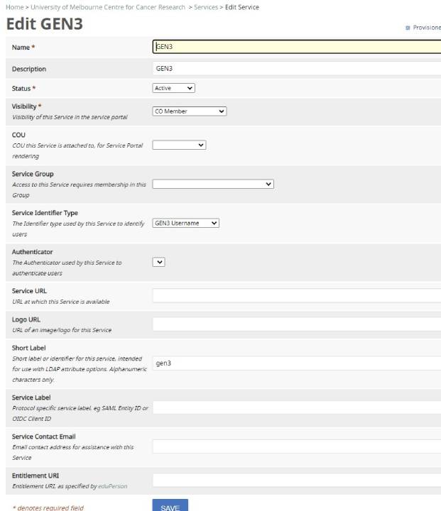

# CILogon

## Related

See also

- [Workshop](../workshop) notes for ongoing AAI discussion
- User Guide [Login & Signup](../user-guide/login-signup.md) section

## Configure CILogon with Gen3 Fence

> The support for CILogon in the Fence service was implemented by [Scott Koranda](https://github.com/skoranda) with Pull Request [#896](https://github.com/uc-cdis/fence/pull/896).

Update the Cloud Automation deployment manifest to use `fence:2021.08` or recent release.

```bash
# update fence version (if needed)
vim $HOME/cdis-manifest/gen3.cloud.dev.umccr.org/manifest.json

  "fence": "quay.io/cdis/fence:2021.08"
```

Enable CILogon in the Fence config. An example can be found in the [config-default.yaml](https://github.com/uc-cdis/fence/blob/master/fence/config-default.yaml).
```bash
vim $HOME/Gen3Secrets/apis_configs/fence-config.yaml
```

To get the `client_id` and `client_secret` create a new `OIDC Client` in the COmanage Registry Collaborative Organisation (`Configuration` menu). Don't forget to add LDAP to Claim mapping that for the LDAP Attribute `voPersonApplicationUID;app-gen3` to OIDC Claim Name `sub` to get a readable and consistent username (even if linking multiple identities to a COmanage account).

## COmanage Registry

Update COmanage to add an OIDC Client to the Collaborative Organisation (CO) that will access Gen3. The OIDC Client provides the `client_id` and `client_secret` for the Fence config.

Gen3 expects a username. CILogon OIDC config creates and stores this value in `gen3username`. The following outlines the configure change to add a Gen3 username to the COmanage Registry service and enable storage of the corresponding value in the COmanage LDAP repository.

The following steps are performed from within the CO requiring access to Gen3.
1) Add an **Extended Type** for the `gen3username` (Configuration > Extended Types).


2) Add an **Identifier Assignment** for a GEN3 Username (Configuration > Identifier Assignments).


3) Add a **Service** for Gen3 (Configuration > Services).



4) Add the **OIDC CLient** for Gen3 (Configuration > OIDC Clients).


**Note:** Minting a new ODIC Client requires that CILogon.org has registered the CO for the creation of OIDC Clients. This is necessary for delegating the management of OIDC Clients to the CO. This enables the CO admin or COmanage platform admin to mint new OIDC clients without further approval. Alternatively, the CO admin or COmanage platform admin must exchange secrets with CILogon.org to complete any OIDC Client configuration.

5) Once the CO has the ability to mint OIDC Clients, click **Add a New OIDC Client**, fill the fields and submit the form. The client ID and secret will be automatically generated. Add the secret to Fence configuration - CILogon only records a secure hash of the value and cannot recover the secret if it is lost. If that happens, just create a new client and reconfigure the service.

For the OIDC Client to retrieve a user’s Gen3Username from LDAP, \
there should be a **LDAP to Claim mapping** for `voPersonApplicationUID;app-gen3` to OIDC Claim Name `sub`.


