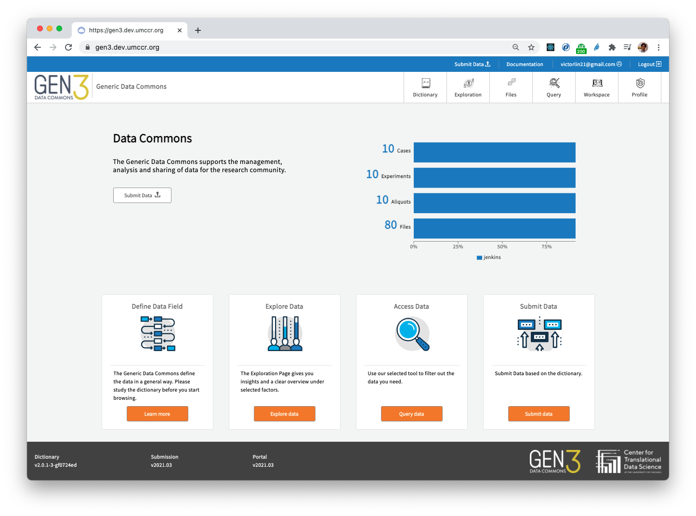
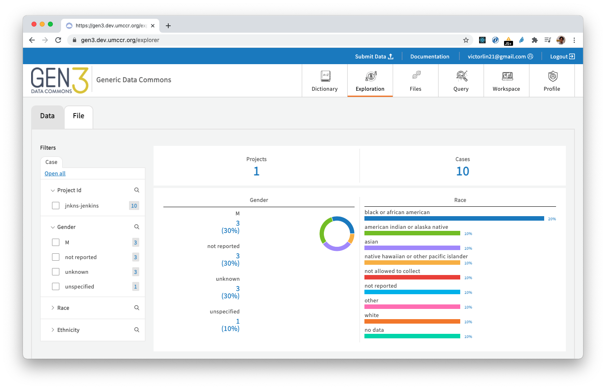
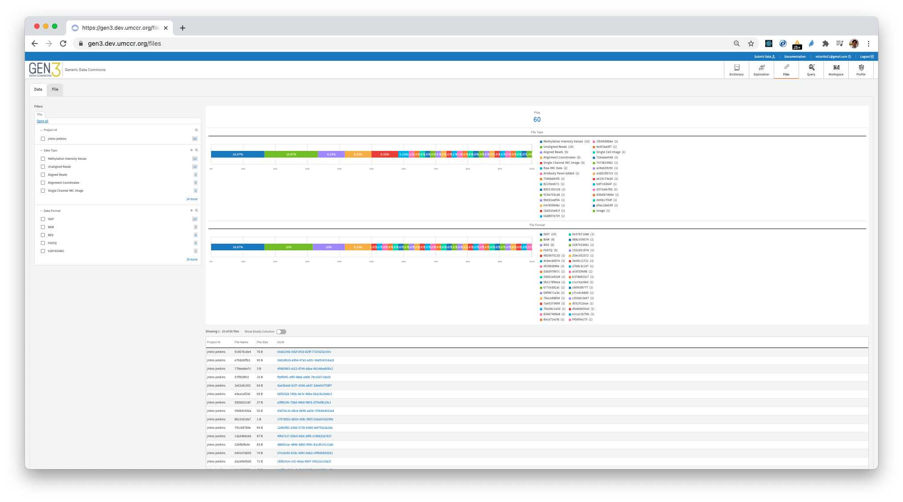
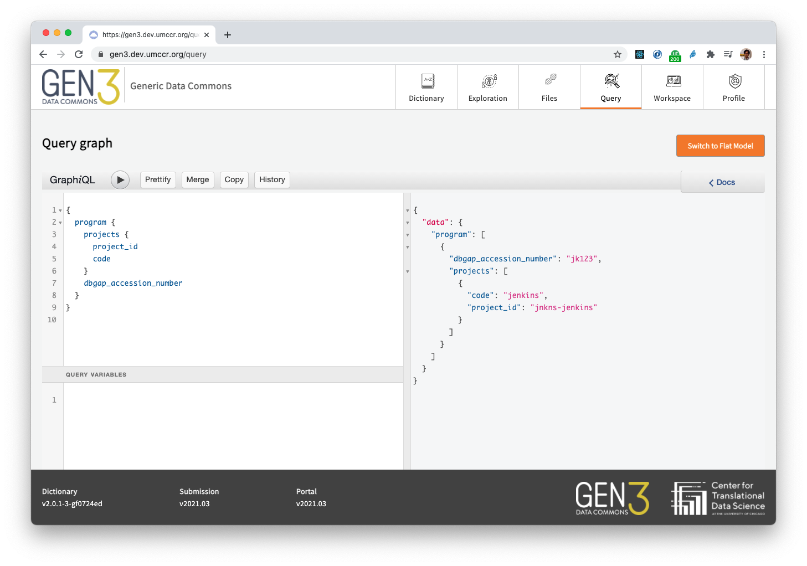

# Deploy

> 💁‍♀️ TL;DR deployment monologue, so that you can replay...

#### 1: Checkout the code
```
git clone https://github.com/uc-cdis/compose-services.git
cd compose-services
```

#### 2: Setup Google OAuth2 client and credentials
```
bash ./creds_setup.sh
(Or)
bash ./creds_setup.sh gen3.dev.umccr.org

vi Secrets/user.yaml
(change username1@gmail.com --> your.real@gmail.com)

vi Secrets/fence-config.yaml
(configure google.client_id and google.client_secret)
```

#### 3: Pull images
```
docker-compose pull
```

#### 4: Turn off guppy in `nginx.conf`
> 🙋‍♂️ Heads-up, this is just temporary. We will reinstate the setting after uploading test metadata. Here is an example diff patch on changes.
```
cat guppy_nginx_off.patch

diff --git a/nginx.conf b/nginx.conf
index c8dd51e..9c4897f 100644
--- a/nginx.conf
+++ b/nginx.conf
@@ -137,9 +137,9 @@ http {
             proxy_pass http://peregrine-service/v0/submission/getschema;
         }

-        location /guppy/ {
-            proxy_pass http://guppy-service/;
-        }
+#        location /guppy/ {
+#            proxy_pass http://guppy-service/;
+#        }

         location /api/v0/submission/graphql {
             if ($cookie_csrftoken = "") {
```

#### 5. Bring up the stack
```
docker-compose up -d
```

##### 5.1. Wait and make sure key services are UP
> 🙋‍♂️ We only need to UP this much of services at this point to ingest the initial simulated test metadata. Ignore other services even if they are down. 
```
docker-compose ps postgres indexd-service arborist-service fence-service metadata-service sheepdog-service peregrine-service pidgin-service revproxy-service portal-service
```

#### 6. Generate test metadata using data simulator
```
export TEST_DATA_PATH="$(pwd)/testData"
mkdir -p "$TEST_DATA_PATH"

docker run -it -v "${TEST_DATA_PATH}:/mnt/data" --rm --name=dsim --entrypoint=data-simulator quay.io/cdis/data-simulator:master simulate --url https://s3.amazonaws.com/dictionary-artifacts/datadictionary/develop/schema.json --path /mnt/data --program jnkns --project jenkins --max_samples 10
```

##### 6.1. Move `testData/` into `Secrets/`
```
mv testData/ Secrets/
ls -l Secrets/testData/
```

##### 6.2. Observe data import order
```
less Secrets/testData/DataImportOrder.txt
```

#### 7. Visit the site and login

- Depends on where are deploying, goto http://localhost or https://gen3.dev.umccr.org 
- You should be able to see the landing page and you should be able to login

#### 8. Create "jnkns" data submission program

> 💡 _this is your center data submission program_

- Goto 
  - http://localhost/_root (Or)
  - https://gen3.dev.umccr.org/_root

- Click "Use Form Submission"
- At drop-down box, enter "program"
- At dbgap_accession_number, enter "jk123"
- At name, enter "jnkns"
- Click "Generate submission JSON from form"
- Click "Submit"

##### 8.1. Create "jenkins" project under "jnkns" program

> 💡 _your center data submission program has one or many projects_

- Goto
  - http://localhost/jnkns (Or)
  - https://gen3.dev.umccr.org/jnkns

> 🙋‍♂️ we will be uploading in order described in `Secrets/testData/DataImportOrder.txt`

- click "Upload file"
- select "project.json"
- click "Submit"

##### 8.2. Uploading metadata under "jenkins" project, under "jnkns" program

> 💡 _here we are fulfilling data dictionary (DD model graph) requirement for your center data submission program_

- Next, goto the project
  - http://localhost/jnkns-jenkins (Or)
  - https://gen3.dev.umccr.org/jnkns-jenkins

- click "Upload file"
- select "experiment.json"
- click "Submit"

> 🙋‍♂️ Perform the same upload procedure and complete the rest metadata uploading
```
case.json
sample.json
aliquot.json
acknowledgement.json
diagnosis.json
clinical_test.json
core_metadata_collection.json
experimental_metadata.json
demographic.json
submitted_copy_number.json
read_group.json
submitted_aligned_reads.json
submitted_somatic_mutation.json
slide.json
keyword.json
slide_count.json
treatment.json
exposure.json
submitted_unaligned_reads.json
read_group_qc.json
slide_image.json
publication.json
aligned_reads_index.json
family_history.json
submitted_methylation.json
```

#### 9. Reinstate guppy in `nginx.conf`

- Next, bring down the stack
```
docker-compose down
```

- Undo the guppy commented-out in `nginx.conf`
```
git status
git checkout nginx.conf
```

- Bring up the stack
```
docker-compose up -d
```

#### 10. Running tube ETL and setup guppy

- First, install Python dependency in tube container
```
docker exec -it tube-service bash -c "cd /tmp/datadictionary && pip install ."
```

- Run script to create ES indices and setup guppy-service
```
bash ./guppy_setup.sh
```

#### 11. All UP

At this point, all 16 microservices should be up and running, assert that:
```
docker-compose ps
docker-compose ps --services

docker-compose ps --services | wc -l
16

bash smoke_test.sh localhost
200  portal  https://localhost/index.html
200  fence  https://localhost/user/.well-known/jwks
200  indexd  https://localhost/index/_status
200  peregrine  https://localhost/peregrine/_status
200  sheepdog  https://localhost/api/_status
200  pidgin  https://localhost/pidgin/_status
```

Refresh the homepage, you should see bar chart there now
<details>
  <summary>Click to expand!</summary>

  
</details>

**Try Exploration page**
<details>
  <summary>Click to expand!</summary>

  
</details>

**Try Files page**
<details>
  <summary>Click to expand!</summary>

  
</details>

**Try Query page**
<details>
  <summary>Click to expand!</summary>

  
</details>

- Click "Switch to Graph Model"
- Clear left panel and enter the following and click play button

_perform graph query: list program and projects_
```
{
  program {
    projects {
      project_id
      code
    }
    dbgap_accession_number
  }
}
```

_perform graph query: list case with their related projects_
```
{
  case {
    submitter_id
    project_id
  }
}
```
