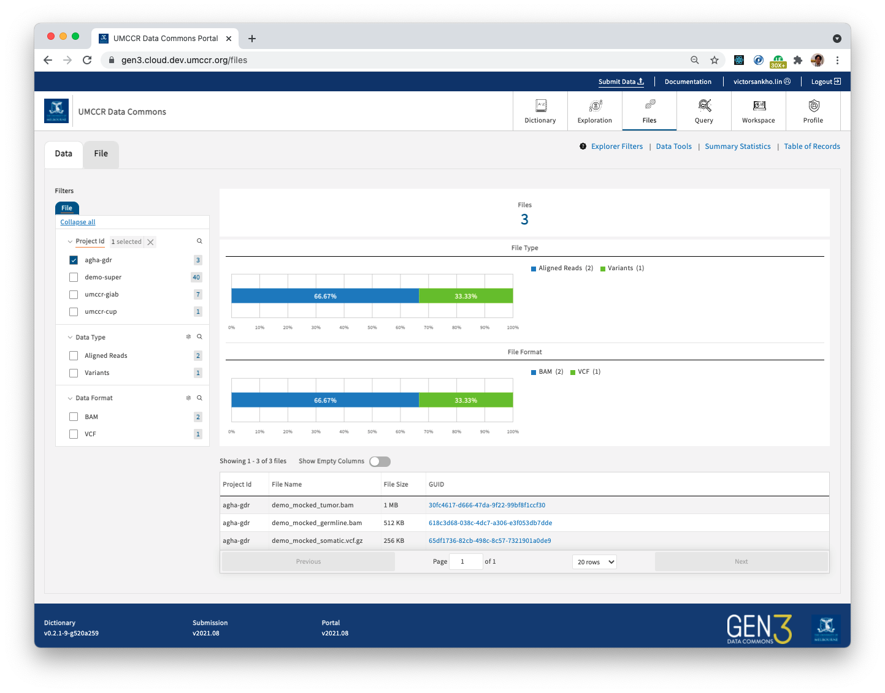

# AGHA GDR Demo Submission with Consent AuthZ

**Context:**

> **Q.** For example if the submission files contain BAMs and VCFs, could we limit access to only the BAMs? Even further, if there are Germline and Tumour BAMs, could be limit access to only Tumour BAMs? Could we grant access to say all VCFs regardless of which project/graph path?
> 
> **A.** Yes, we can consent coded data files. Please continue reading...


> https://gen3.cloud.dev.umccr.org/agha-gdr



This demo contains scenario:
- there exists pre-existing bucket with data
- create indexd records of these data files using bucket manifest
- submit (DD graph) metadata for these data files
- follow [granular access to data files](https://gen3.org/resources/operator/#7-how-to-upload-and-control-file-access-via-authz) -- that in-turn, in line with [data file metadata `consent_codes` properties](img/agha_gdr_data_file_consent_codes.png)

## 0. Initiate AGHA Program & GDR Submission Project

- Follow User Guide's [Program & Project](../../user-guide/program-project.md) 

## 1. Mock Pre-existing Data

```
dd bs=1024 count=256 </dev/urandom > demo_mocked_somatic.vcf.gz

wc -c demo_mocked_somatic.vcf.gz
  262144 demo_mocked_somatic.vcf.gz

md5sum demo_mocked_somatic.vcf.gz
fbbd092bf77294b638befe84ab33f6dc  demo_mocked_somatic.vcf.gz

uuid v4
65df1736-82cb-498c-8c57-7321901a0de9

aws s3 cp demo_mocked_somatic.vcf.gz s3://umccr-test-data-bucket/SBJ00001/demo_mocked_somatic.vcf.gz
```

```
dd bs=1024 count=1024 </dev/urandom > demo_mocked_tumor.bam

wc -c demo_mocked_tumor.bam
 1048576 demo_mocked_tumor.bam

md5sum demo_mocked_tumor.bam
12d0530416d935b8f0a26e210d18c39c  demo_mocked_tumor.bam

uuid v4
30fc4617-d666-47da-9f22-99bf8f1ccf30

aws s3 cp demo_mocked_tumor.bam s3://umccr-test-data-bucket/SBJ00001/demo_mocked_tumor.bam
```

```
dd bs=1024 count=512 </dev/urandom > demo_mocked_germline.bam

wc -c demo_mocked_germline.bam
  524288 demo_mocked_germline.bam

md5sum demo_mocked_germline.bam
ed6170fd2d45c6779f1555922946d2b3  demo_mocked_germline.bam

uuid v4
618c3d68-038c-4dc7-a306-e3f053db7dde

aws s3 cp demo_mocked_germline.bam s3://umccr-test-data-bucket/SBJ00001/demo_mocked_germline.bam
```

```
aws s3 ls s3://umccr-test-data-bucket --recursive > list.stdout
```

## 2. Prepare Bucket Manifest
```
wget https://raw.githubusercontent.com/umccr/g3po/dev/sample/manifest.tsv

edit manifest.tsv
```

## 3. Perform Indexing using Manifest

```
export GEN3_URL=https://gen3.cloud.dev.umccr.org/
g3po index health
g3po index manifest
```

## 4. Graph Metadata

### 4.1 Download Metadata Template

- https://gen3.cloud.dev.umccr.org/DD
- Download template > JSON

### 4.2 Fill Metadata

- Complete metadata information in template JSON files

### 4.3 Submit Metadata

- https://gen3.cloud.dev.umccr.org/agha-gdr
- Upload File > template JSON files

## 5. Admin Follow up

- You may need to rerun Tube ETL to sync ElasticSearch indexes
- You may need to update `user.yaml` to take effect on new indexes' authz, if any
- You may need to update [Fence config](https://github.com/umccr/gen3-doc/blob/main/workshop/fence-config.yaml#L558) to include the new bucket; provide S3 compliant endpoint if it is not native bucket

## 6. Accessing Controlled Data

In order to test data access authorization, we configure `user.yaml` ACL in such that:

- All authenticated users can download Tumor BAM (`demo_mocked_tumor.bam`) from AGHA GDR submission. (i.e. GA4GH Passport Visa scope `AcceptedTermsAndPolicies`, `ResearcherStatus`, etc)
- Access to Germline BAM (`demo_mocked_germline.bam`) and Somatic VCF (`demo_mocked_somatic.vcf.gz`) must be Consented. (i.e. GA4GH Passport Visa with `ControlledAccessGrants`)
- _See [Login & Signup section](../../user-guide/login-signup.md) as this plays along those lines in tandem..._

**Statements:**

1. As an authenticated user, verify that you can view AGHA GDR submission through File Exploration as screen described in ☝️ top of the page.
2. As an authenticated user, verify that you can download Tumor BAM.
3. As an authenticated user, verify that download attempt to Germline BAM or Somatic VCF return [Unauthorized 401 Error page](img/agha_gdr_demo_unauthorized.png).
4. As an authenticated [API user](../../user-guide/using-api.md), verify that you can access Tumor BAM through GA4GH DRS Object [PreSigned URL](img/agha_gdr_drs_get_object_tumor.png).
5. As an authenticated API user, verify that accessing Germline BAM through GA4GH DRS Object access method return [Unauthorized 401 Error](img/agha_gdr_drs_get_object_germline.png).
6. As an authenticated API user, verify that accessing Somatic VCF through GA4GH DRS Object access method return [Unauthorized 401 Error](img/agha_gdr_drs_get_object_somatic.png).
7. As an authenticated user, verify that you can access to AGHA GDR project submission page and able to browse through meta-information (metadata) through navigating graph nodes. e.g.
   - Goto https://gen3.cloud.dev.umccr.org/agha-gdr
   - Click on "Diagnosis" node > View
   - Click on "Sample" node > View
   - _so on so ford_

## 7. Summary

Off the shelf Gen3 deployment ship with Fence and Arborist component which offer access authorization such that

- We can configure granular access control on **_the actual File Object_** in data warehouse by following some consent code or scheme.
  - Authorization is quite deterministic i.e. happening at File Object indexing time and this can be added/updated later as if access policy changes.
  - Authorization scheme is just a resource path and, this can be arbitrary; e.g. we made up `/programs/agha/projects/gdr/consents/germline` and, formation of the latter part `consents/germline` can be some scheme or consent code (may/may-not line up with [GA4GH DUO](https://www.ga4gh.org/genomic-data-toolkit/) and/or sync from DAC Portal or COmanage Registry group, if any)
- At the moment, **_Gen3 has limitation on meta-information protection_**. Metadata access granularity can be only up to Project level (i.e. all or nothing). [Remark from official documentation](https://github.com/uc-cdis/fence/blob/master/docs/user.yaml_guide.md#notes) as follows.

    > While Arborist itself allows granular and inherited access through use of its resource tree / paths, granular access control beyond the program and project in the current Gen3 graph is not supported at the moment.
