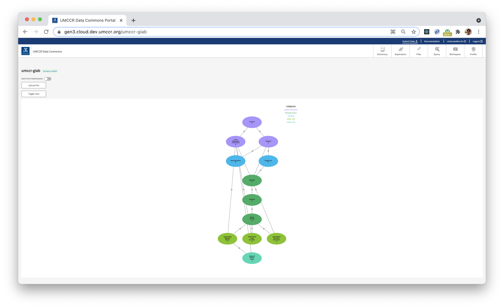
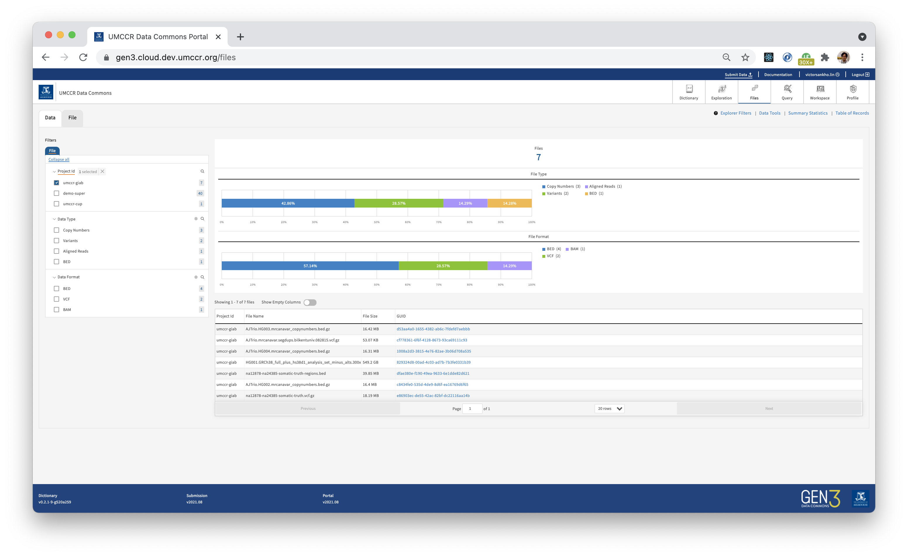

# GIAB Submission

- _aka how to include another bucket with existing data_
- _aka how Gen3 supports external data stores (e.g., an NCI S3-compatible object store)_

> https://gen3.cloud.dev.umccr.org/umccr-giab



## Prepare Bucket Manifest

- Consider we have the following S3 bucket called `umccr-gen3-giab` has "**some existing data**" 
- _Note, we will simulate this S3 bucket with some NovaAlign Illumina HiSeq 300x reads and analysis public dataset from **Genome in a Bottle** -- `s3://giab`_

```
aws s3 ls s3://umccr-gen3-giab --recursive > list.stdout
```

- Prepare bucket `manifest.tsv` file
```
cd step1
wget https://raw.githubusercontent.com/umccr/g3po/dev/sample/manifest.tsv
```

- Edit `manifest.tsv` using `list.stdout`

🛑 NOTE: Because this bucket contains very small data, a simple listing command work! Plus, there exists md5 checksum and file size length meta-info files avail in the bucket. However, for big data bucket, you would require more preparation. It depends on these factors: 
  1. Whether there exist md5 checksum. Otherwise, you would require compute them.
  2. You would also need to know data file size in bytes. Typically, `wc -c file.bam` or `s3api head-object` to get content length.
  3. Depends on how large the existing bucket situation, you may need to utilise boto3 or Go AWS SDK library to efficiently crawl through file objects for manifest file preparation.
  4. See these pointers for some tinkering:
     1. https://gen3.org/resources/user/submit-data/sower/
     2. https://github.com/uc-cdis/cloud-automation/blob/master/doc/bucket-manifest.md


## Step 1

- Once manifest is ready, run indexing using `manifest.tsv`:
```
export GEN3_URL=https://gen3.cloud.dev.umccr.org/
g3po index health
g3po index manifest
```

- Output is in `manifest_output_<timestamp>.tsv`


## Step 2

- Populate and submit metadata according to Data Dictionary Graph through Gen3 Portal UI.

- Follow _top-down_ approach; i.e., start from parent node all the way to data file node in the leave.

- Watch [Submitting Data to a Gen3 Commons](https://www.youtube.com/watch?v=F2EOtHPg6g8) or please go through [submit-data.md](../../user-guide/submit-data.md)

- Please do observe [step2 directory](step2) that contain submission templates download from [Data Dictionary UI](https://gen3.cloud.dev.umccr.org/DD) and populated with some metadata _(I just make up!)_; Subject, Sample, etc...

> When Data Dictionary is stable, it is possible to automate or make it programmatic pipeline of both Step 1 and Step 2. This could be continuation of `g3po` CLI or through SDK or direct API call.


## Follow up

- You may need to rerun Tube ETL to sync ElasticSearch indexes
- You may need to update `user.yaml` to take effect on new indexes' authz, if any
- You may need to update [Fence config](https://github.com/umccr/gen3-doc/blob/main/workshop/fence-config.yaml#L558) to include the new bucket; provide S3 compliant endpoint if it is not native bucket

## Accessing Data

- Now `umccr-giab` project submission can be browsable through Gen3 Portal Data and Files Exploration UI
- As well as through [Index API and GA4GH DRS API](../../user-guide/using-api.md)


