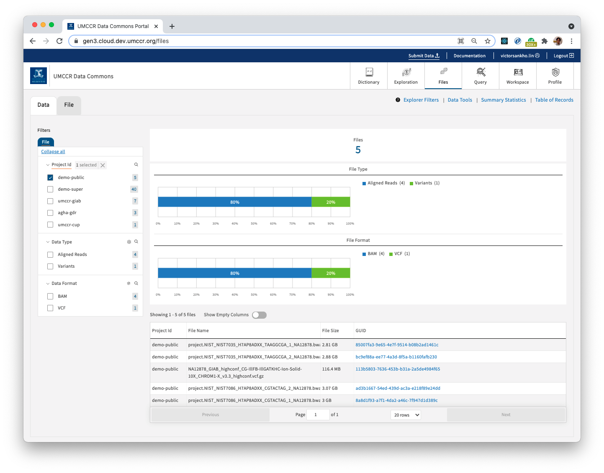

# Public Dataset with DRS to Htsget

_GA4GH: DRS to Htsget and, Passport in mix between. How they work together, in end-to-end sense?_

> https://gen3.cloud.dev.umccr.org/demo-public



In this demo, we will explore a scenario:
- there are pre-existing public dataset that are available through GA4GH Htsget
- hence, using Gen3 implementation of GA4GH DRS endpoint with Htsget as access method!

## 0. Initiate Program & Project

- Follow User Guide's [Program & Project](../../user-guide/program-project.md)
- Created program and project as follows:
```
Program: demo
Project: public
```

## 1. Prepare Manifest

> 🙋‍♂️Please note that typically this is a S3 bucket manifest. However, we will be **indexing htsget dataset** that also available with `htsget://` protocol. Contrast to `s3://`. We will simply use GA4GH Htsget Reference Implementation service and, one of its available dataset as described in https://htsget.ga4gh.org/docs/

```
g3po index template

(edit manifest.tsv)
```

### Gen3 Indexd Concept

Observe that, in `manifest.tsv`, we prepare as follows.

e.g. taking a look at the first row Alignment Read dataset `giab.NA12878.NIST7035.1`

The GUID `85007fa3-9e65-4e7f-9514-b08b2ad1461c` that point to data file locations at
```
htsget://htsget.ga4gh.org/reads/giab.NA12878.NIST7035.1
https://htsget.ga4gh.org/reads/giab.NA12878.NIST7035.1
s3://giab/data/NA12878/Garvan_NA12878_HG001_HiSeq_Exome/project.NIST_NIST7035_H7AP8ADXX_TAAGGCGA_1_NA12878.bwa.markDuplicates.bam 
ftp://ftp-trace.ncbi.nlm.nih.gov/ReferenceSamples/giab/data/NA12878/Garvan_NA12878_HG001_HiSeq_Exome/project.NIST_NIST7035_H7AP8ADXX_TAAGGCGA_1_NA12878.bwa.markDuplicates.bam
```

These are all talking about the same dataset with different locations by totally different operators. Hence, DRS URI `drs://gen3.cloud.dev.umccr.org/85007fa3-9e65-4e7f-9514-b08b2ad1461c` is a sticky pointer that you can use in your analysis workflow. We will talk about _**DRS Access Method**_ in tick, next.

## 2. Perform Indexing using Manifest

```
export GEN3_URL=https://gen3.cloud.dev.umccr.org/
g3po index health
g3po index validate
g3po index manifest
```

## 3. Graph Metadata

### 3.1 Download Metadata Template

- https://gen3.cloud.dev.umccr.org/DD
- Download template > JSON

### 3.2 Fill Metadata

- Complete metadata information in template JSON files

### 3.3 Submit Metadata

- https://gen3.cloud.dev.umccr.org/demo-public
- Upload File > template JSON files

## 4. Admin Follow up

- You may need to rerun Tube ETL to sync ElasticSearch indexes
- You may need to update `user.yaml` to take effect on new indexes' authz, if any (Refer Fence documentation on how to set up Public dataset)

## 5. Accessing Data 

_This demonstrates how the two specs inter-play: GA4GH DRS & GA4GH Htsget_

**Prerequisite**: User Guide's [using-api.md](../../user-guide/using-api.md)

### 5.1 giab.NA12878.NIST7035.1

- Get DRS Object

```
curl -s "https://gen3.cloud.dev.umccr.org/ga4gh/drs/v1/objects/85007fa3-9e65-4e7f-9514-b08b2ad1461c" | jq
```

```json
{
  "access_methods": [
    {
      "access_id": "ftp",
      "access_url": {
        "url": "ftp://ftp-trace.ncbi.nlm.nih.gov/ReferenceSamples/giab/data/NA12878/Garvan_NA12878_HG001_HiSeq_Exome/project.NIST_NIST7035_H7AP8ADXX_TAAGGCGA_1_NA12878.bwa.markDuplicates.bam"
      },
      "region": "",
      "type": "ftp"
    },
    {
      "access_id": "s3",
      "access_url": {
        "url": "s3://giab/data/NA12878/Garvan_NA12878_HG001_HiSeq_Exome/project.NIST_NIST7035_H7AP8ADXX_TAAGGCGA_1_NA12878.bwa.markDuplicates.bam"
      },
      "region": "",
      "type": "s3"
    },
    {
      "access_id": "https",
      "access_url": {
        "url": "https://htsget.ga4gh.org/reads/giab.NA12878.NIST7035.1"
      },
      "region": "",
      "type": "https"
    },
    {
      "access_id": "htsget",
      "access_url": {
        "url": "htsget://htsget.ga4gh.org/reads/giab.NA12878.NIST7035.1"
      },
      "region": "",
      "type": "htsget"
    }
  ],
  "aliases": [],
  "checksums": [
    {
      "checksum": "edb7bba8479cf224bf3015fdfda44f39",
      "type": "md5"
    }
  ],
  "contents": [],
  "created_time": "2021-09-07T14:08:54.031291",
  "description": null,
  "form": "object",
  "id": "85007fa3-9e65-4e7f-9514-b08b2ad1461c",
  "mime_type": "application/json",
  "name": "project.NIST_NIST7035_H7AP8ADXX_TAAGGCGA_1_NA12878.bwa.markDuplicates.bam",
  "self_uri": "drs://gen3.cloud.dev.umccr.org/85007fa3-9e65-4e7f-9514-b08b2ad1461c",
  "size": 3020450026,
  "updated_time": "2021-09-07T23:40:04.281944",
  "version": "0b289cf5"
}
```
 
- As seen in DRS Object, we can now choose to access object bytes with different access mechanisms. 

```
curl -s -H "Authorization: Bearer $GEN3_TOKEN" "https://gen3.cloud.dev.umccr.org/ga4gh/drs/v1/objects/85007fa3-9e65-4e7f-9514-b08b2ad1461c/access/s3" | jq
```

```
curl -s -H "Authorization: Bearer $GEN3_TOKEN" "https://gen3.cloud.dev.umccr.org/ga4gh/drs/v1/objects/85007fa3-9e65-4e7f-9514-b08b2ad1461c/access/htsget" | jq
```

```
curl -s -H "Authorization: Bearer $GEN3_TOKEN" "https://gen3.cloud.dev.umccr.org/ga4gh/drs/v1/objects/85007fa3-9e65-4e7f-9514-b08b2ad1461c/access/https" | jq
```

```
curl -s -H "Authorization: Bearer $GEN3_TOKEN" "https://gen3.cloud.dev.umccr.org/ga4gh/drs/v1/objects/85007fa3-9e65-4e7f-9514-b08b2ad1461c/access/ftp" | jq
```

- All these attempt request throws 400 Error as follows:

```
{
  "msg": "Unable to get presigned URL from Fence",
  "status_code": 400
}
```

**A couple of notes:**

- Since `s3://giab` is a public bucket, attempt to get PreSigned URL from Fence is redundant and, hence no longer required implicitly.
- Trying to access with other protocol URI scheme for Singed URL is also not supported as there is no such "Singed URL" on these protocols nor, Gen3 Fence is not supported this Singed URL operation on anything other than `s3` and `gs`.
- Fence could _ideally_ support [Illumina Connected Analytics](https://support.illumina.com/sequencing/sequencing_software/illumina-connected-analytics.html) (ICA) [Genomic Data Store Service](https://aps2.platform.illumina.com/gds/swagger/index.html) (GDS) protocol, i.e. `gds://` URI scheme. We have [libica Python SDK](https://github.com/umccr-illumina/libica) ready and, could add support into Fence component for how to Sign URL from `gds://` protocol.

## Other Datasets

Similarly, you can try the reset of other datasets like so:

- BAM: giab.NA12878.NIST7035.2
```
curl -s "https://gen3.cloud.dev.umccr.org/ga4gh/drs/v1/objects/bc9ef88a-ee77-4a3d-8f5a-b1160fafb230" | jq
```

- BAM: giab.NA12878.NIST7086.1
```
curl -s "https://gen3.cloud.dev.umccr.org/ga4gh/drs/v1/objects/8a8d1f93-a7f1-4da2-a46c-7f947d1d389c" | jq
```

- BAM: giab.NA12878.NIST7086.2
```
curl -s "https://gen3.cloud.dev.umccr.org/ga4gh/drs/v1/objects/ad3b1667-54ed-439d-ac3a-e218f89e24dd" | jq
```

- VCF: giab.NA12878
```
curl -s "https://gen3.cloud.dev.umccr.org/ga4gh/drs/v1/objects/113b5803-7636-453b-b31a-2a5de4984f65" | jq
```

## Getting Slices with Htsget

We have already discussed and written **_how to use Htsget to get slices of BAM and VCF_** in a couple of locations as follows; so won't be repeating here.

- https://github.com/umccr/infrastructure/tree/master/cdk/apps/htsget#htsget-101
- https://github.com/umccr/infrastructure/blob/master/cdk/apps/htsget/HTSGET_PASSPORT.md
- https://github.com/igvteam/igv.js/issues/1187

## Research Questions?

> Just to remark on GA4GH context that, now we can tinker how this would further play out with GA4GH Passport and its Researcher ID & AAI and Passport VISA token transition from DRS to Htsget endpoint?

> Also note that, both DRS and Htsget play out together here. This is mainly due to, through Gen3 Indexd. Do we have any GA4GH spec discussion on "object indexing" middleware? Hence, we could have some _**standardized**_ ID resolver? Or, is this just UUID and/or any other _**use-your-own-discretion**_ object indexing and ID schemes; or follow Gen3 Indexd GUID https://dataguids.org those who adopt this platform. How about those who are not using Gen3 Indexd? Should Gen3 Indexd be part of GA4GH spec/standard? Or, all this is always relative to underlying data store platform?
