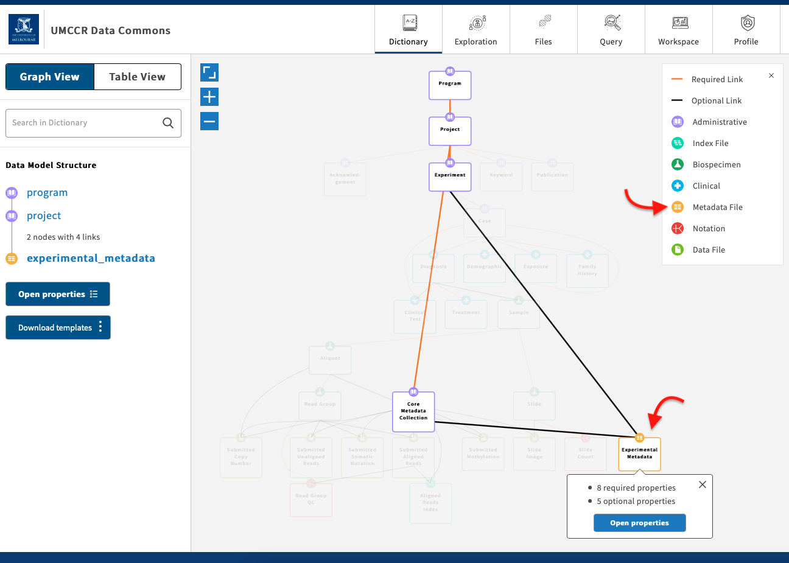
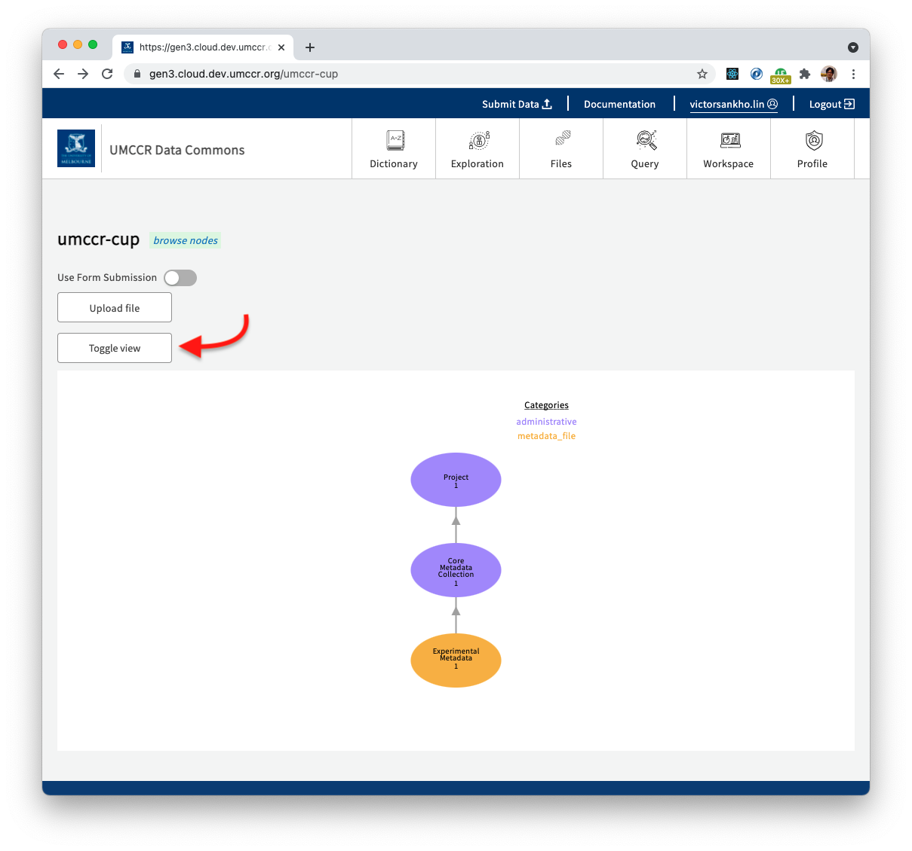

# Data Submission (User Flow)

> This is Data Submission (User Flow). For _manifest-based_ approach, see [submit](../submit).

In this exercise, we will be submitting "Experimental Metadata File". A subset of data model graph as follows:



- In order to submit a "Metadata File", we have to fulfil the️ data graph path whereas:
  - Program (Administrative node)
  - Project (Administrative node)
  - Experiment (Administrative node)
  - Core Metadata Collection (Administrative node)
  - Experimental Metadata (Metadata File node)
  - Take note on: 
    - Black line (Operational Link)
    - Orange line (Required Link)

- [Programs and Projects](program-project.md) are typically created by Program Manager.

- There are two possible routes in the path. You can take either through:
  - Experiment node, or
  - Core Metadata Collection node
  
- In the following, we are mapping the path through "Core Metadata Collection" node. Hence, let's create an instance of "Core Metadata Collection".

### Step 1

- You should have appropriate permission for a project under a program for data submission.
- From top navigation menu or home page, click "Submit Data" button, which in-turn open to https://gen3.cloud.dev.umccr.org/submission
- At "List of Projects" section, click "Submit Data" button for "umccr-cup", which in-turn open to https://gen3.cloud.dev.umccr.org/umccr-cup
- Click "Use Form Submission"
- At dropdown, enter and select "core_metadata_collection"
- Must fill as follows, for example:
    - **contributor**: _CUP Demo_
    - **creator**: _UMCCR CUP_
    - **description**: _A CUP demo core metadata collection_
    - **project_code**: _cup_
    - **submitter_id**: _cup-demo_
- Click "Generate submission JSON from form"
- You should see generated JSON (you may still edit JSON there)
- Once finalise, click **Submit**

> You should see "Succeeded: 200" green bar.

- Reload the page

### Step 2

_Installing Gen3 CLI Client_

- [Download](https://github.com/uc-cdis/cdis-data-client/releases) and install the CLI, e.g. for macOS:
```
wget https://github.com/uc-cdis/cdis-data-client/releases/download/2021.05/dataclient_osx.zip
unzip dataclient_osx.zip
mv gen3-client /usr/local/bin
chmod +x /usr/local/bin/gen3-client
gen3-client --help
```

- Go to your [Profile](https://gen3.cloud.dev.umccr.org/identity) > Create API key > download `credentials.json`

- Configure
```
gen3-client configure --profile=gen3 --cred=~/Downloads/credentials.json --apiendpoint=https://gen3.cloud.dev.umccr.org
```

- Check auth
```
gen3-client auth --profile=gen3
```

### Step 3

- Create a test file
```
touch cup_demo_test1.txt
echo "LOREM IPSUM" > cup_demo_test1.txt
```

- Upload test file
```
gen3-client upload --profile=gen3 --upload-path=cup_demo_test1.txt
```

> Take note of GUID e.g. `f5c4e255-2bbf-4026-9fbd-4dec3ae5f886`

### Step 4

_Mapping uploaded file_

- From top navigation menu or home page, click "Submit Data" button, which in-turn open to https://gen3.cloud.dev.umccr.org/submission
- At "Data Submission" section, look for "Map My Files".
- Click "Map My Files" button, which in-turn open to https://gen3.cloud.dev.umccr.org/submission/files
- At "Unmapped Files" section, it should contain "cup_demo_test1.txt" with status "Ready"
- Select checkbox and click "Map Files" button
- At Project dropdown, select "umccr-cup"
- At File Node dropdown, select "experimental_metadata"
  - **data_category**: _CUP Demo_
  - **data_type**: _Experimental Metadata_
  - **data_format**: _txt_
  - **core_metadata_collection**: _cup-demo_
- Click "Submit"

### Step 5

- From top navigation menu or home page, click "Submit Data" button, which in-turn open to https://gen3.cloud.dev.umccr.org/submission
- At "List of Projects" section, select `umccr-cup` by clicking "Submit Data" button (also observe file count)
- It opens project page https://gen3.cloud.dev.umccr.org/umccr-cup
- Click "Experimental Metadata" > Click "View" or "Download" > to look for `object_id`
- File can access by GUID (aka `object_id`) as follows:

**By UI:**
- https://gen3.cloud.dev.umccr.org/files/f5c4e255-2bbf-4026-9fbd-4dec3ae5f886
  
**By API:**
- See [using-api](using-api.md)


### More Metadata

- By this far, we have only done a partial data submission, that is: 
  - Uploaded a data file (that created Globally Unique ID -- GUID)
  - Populated its minimal metadata (i.e. _Map Files_ to _core_metadata_collection_ node) only
  - There are still other nodes in data model Graph that you should supplement to this data submission
  - You can view this by going into the project view:
    - Top Menu > Submit Data > List of Projects > umccr-cup > Click "Submit Data" button
  - Clicking on "Toggle view" button will show a complete metadata graph that will have to fulfil a complete data submission 



- Please refer Jim's tutorial on [Submitting Data to a Gen3 Commons](https://www.youtube.com/watch?v=F2EOtHPg6g8) for how to submit a complete metadata to conform the specified Data Dictionary model.

## REF

- [Gen3 Data Commons - Data Upload Tutorial](https://www.youtube.com/watch?v=QxQKXlbFt00)
- [Submitting Data to a Gen3 Commons](https://www.youtube.com/watch?v=F2EOtHPg6g8)
- https://gen3.org/resources/user/gen3-client/
- https://gen3.org/resources/user/access-data/
- https://gen3.org/resources/user/submit-data/
